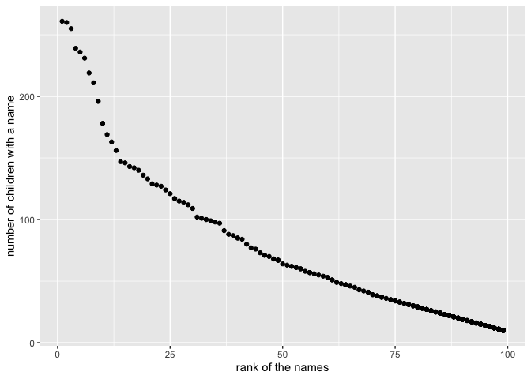

p8105\_hw2\_al3998
================
AimingLiu
9/24/2019

## Problem 1

``` r
#Import the data#
mrtrash_data = read_excel("~/Desktop/data science/p8105_hw2_al3998/data/TrashWheel.xlsx",
              sheet = "Mr. Trash Wheel",skip = 1)%>%
             janitor::clean_names()%>% 
             drop_na(dumpster)%>%
             select(dumpster:homes_powered) %>% 
             mutate(sports_balls = as.integer(round(sports_balls, digits = 0)))

preci_17_data = read_excel("~/Desktop/data science/p8105_hw2_al3998/data/TrashWheel.xlsx",
               sheet = "2017 Precipitation",range = "A2:B14")%>%
                janitor::clean_names()%>%
                drop_na(total)%>%
                mutate(year = "2017")             

preci_18_data = read_excel("~/Desktop/data science/p8105_hw2_al3998/data/TrashWheel.xlsx",
                sheet = "2018 Precipitation",range = "A2:B14")%>%
                janitor::clean_names()%>%
                drop_na(total)%>%
                mutate(year = "2018")
preci_data = bind_rows(preci_17_data,preci_18_data)%>%
   mutate(month = month.name[month])
```

After reading and cleaning the data in the Mr. Trash Wheel sheet,there
are 344 obs.of 14 variables,the variable columns in the data set include
dumpster, month, year, date, weight\_tons, volume\_cubic\_yardsand some
other columns,among which all the numbers in the column “sports\_balls”
have been transformed into integer.

After reading and cleaning the data in the 2018 Precipitation,there are
12 obs.of 3 variables including columns month, total, year. After
reading and cleaning the data in the 2017 Precipitation,there are 12
obs.of 3variables including columns of month, total, year.

After combining 2018 Precipitation and 2017 Precipitation, the data in
the data set called preci\_data,there are 24 obs. of 3 and include
month, total, year.

The total precipitation in 2018 is 70.33. And the median of sports balls
in a dumpster in 2017 is
8.

## Problem 2

``` r
pols_month_data = read_csv("~/Desktop/data science/p8105_hw2_al3998/data/pols-month.csv")%>%
                  janitor::clean_names()%>%
                  separate(mon,into = c("year", "month","day"), sep = "-")%>%
                  mutate(month = month.name[as.numeric(month)])%>%
                  pivot_longer(cols = starts_with("prez"),
                               names_to = "president",
                               names_prefix = "prez_" )%>%
                  filter(value != 0)%>%
                  select(-day,-value)
 
snp_data  =   read_csv("~/Desktop/data science/p8105_hw2_al3998/data/snp.csv")%>%               
              janitor::clean_names()%>%
              separate(date,into = c("month", "day","year"), sep = "/")%>%
              arrange(year, month)%>%
              mutate(month = month.name[as.numeric(month)])%>%
              select(year,month,close,-day)

 
 unemployment_data = read_csv("~/Desktop/data science/p8105_hw2_al3998/data/unemployment.csv")%>%
                     pivot_longer(
                     cols=Jan:Dec,
                     names_to = "month")%>%
                     arrange(Year,month)%>%
                     mutate(month = match(month, month.abb))%>%
                     mutate(month = month.name[month])%>%
                     mutate(year = as.character(Year))
## merging data                    
pols_snp_data = left_join(pols_month_data, snp_data,by = c("year","month"))      
pols_snp_une_data = left_join(pols_snp_data, unemployment_data,by = c( "year","month"))
```

The first data frame “pols\_month\_data” is a data frame with 822 rows
and 9 columns, the range of the year in this adta set is from 1947 to
2015,and the name of key variables in this data set are year, month,
gov\_gop, sen\_gop, rep\_gop, gov\_dem, sen\_dem, rep\_dem, president

The second data frame “snp\_data” is a data frame with 787 rows and 3
columns, the range of the year in this adta set is from 1950 to 2015,and
the name of key variables in this data set are year, month, close

The third data frame “unemployment\_data” is a data frame with 816 rows
and 4 columns, the range of the year in this adta set is from 1948 to
2015,and the name of key variables in this data set are Year, month,
value, year

After merging the three data sets,the data sets called
“pols\_snp\_une\_data” include 822 rows and 12 columns.Some data in
this data set is missing because that the range of years are
different.

## Problem 3

## Load and tidy the data

``` r
popular_baby_data = read_csv("~/Desktop/data science/p8105_hw2_al3998/data/Popular_Baby_Names.csv")%>%
                    janitor::clean_names()%>%
                    mutate(ethnicity = recode(ethnicity,"ASIAN AND PACIFIC ISLANDER" = "ASIAN AND PACI","BLACK NON HISPANIC" = "BLACK NON HISP","WHITE NON HISPANIC" = "WHITE NON HISP"))%>%
                     mutate(childs_first_name = str_to_title(childs_first_name))%>%
                     distinct()
```

## Produce a table showing the rank in popularity of the name “Olivia”

``` r
    Olivia_data = popular_baby_data %>% 
    filter(gender == "FEMALE" & childs_first_name == "Olivia") %>%
    pivot_wider(names_from = year_of_birth, values_from = rank,id_cols = ethnicity)
```

## Producing a table showing the most popular name among male children over time.

``` r
   male_data = filter(popular_baby_data,gender == "MALE",rank =="1")%>%
   select(ethnicity,year_of_birth,childs_first_name) %>% 
   pivot_wider(names_from = year_of_birth, values_from = childs_first_name)
```

## producing a scatter plot

``` r
  plot_data = filter(popular_baby_data,gender == "MALE",ethnicity == "WHITE NON HISP",year_of_birth == "2016")
  ggplot(plot_data,aes(x = rank,y = count))+geom_point()+xlab( "rank of the names")+ ylab( "number of children with a name")
```

<!-- -->

\#When the rank of the names gets higher,there are more children have
this name
